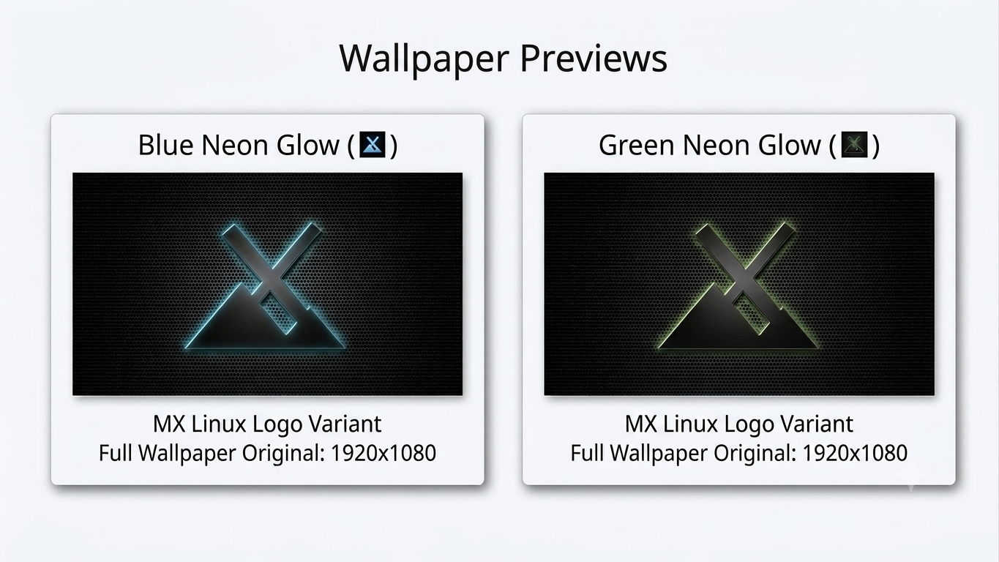

# MX Linux Dark Metallic Wallpapers

A collection of custom dark metallic mesh desktop wallpapers featuring the official MX Linux logo with subtle backlit accents.

## 🖼️ Preview

--

## ⚙️ Specs

* **Texture:** Perforated dark metal / brushed steel mesh
* **Aspect Ratio:** 16:9 Widescreen
* **Variants:** Blue & Green
* **Format:** Lossless / High-Quality JPEG

---

## ⬇️ How to Download

1. Click on any wallpaper image file in the file list above.
2. Click the **Raw** button in the top-right header.
3. Right-click the displayed image and choose **Save Image As...**

---

### 📦 Other Projects & Utilities

If you use MX Linux or other Debian/Arch-based distributions, feel free to explore my other repositories for system maintenance scripts and software tools:
* [GitHub Profile: cybermaxpower](https://github.com/cybermaxpower)
